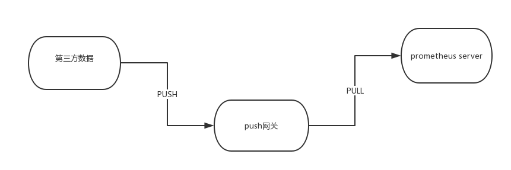

# push网关

可以向push网关以http的方式发送数据,发送的数据会被prometheus server抓取,实现第三方业务的监控.

**注意:push网关不负责存储数据,只以对外开放HTTP API的形式输出各个指标最新的一次数据**

用户发送的数据有一定的格式要求,必须是prometheus定义的格式类型.

    <metrics_name>{<instance_name>="<instance_value>",<label_name>="<label_value>"} <metrics_value> <timestamp>

- **尖括号表示里面的数据为变量**

- **\<timestamp\>为可选参数**

- **编码方式必须是utf8,且每一行都以\n结尾"**

- **请求的Content-Type必须设置为"text/plain; version=0.0.4"**

如:

    some_metrics_test{controller=\"test\"} 1243\n

**(2017.4.7)网关部署在113的9091端口上,API为/metrics**

以python为例:

    import requests

    metrics = 'python_metrics{controller=\"controller_test\"} 123\n'

    headers = {'Content-Type':'text/plain; version=0.0.4'}

    url = 'http://192.168.1.113:9091/metrics/job/job'

    req = requests.post(url, data=metrics , headers=headers)

执行成功后不会返回任何信息,状态码为202

<!--## 数据的输出格式

有两种输出格式可选:

- text

    \# HELP api_http_request_count The total number of HTTP requests.

    \# TYPE api_http_request_count counter

    http_request_count{method="post",code="200"} 1027 1395066363000

    http_request_count{method="post",code="400"}    3 1395066363000

    \# Escaping in label values:

    msdos_file_access_time_ms{path="C:\\DIR\\FILE.TXT",error="Cannot find file:\n\"FILE.TXT\""} 
    1.234e3
    
    \# Minimalistic line:
    
    metric_without_timestamp_and_labels 12.47
    
    \# A weird metric from before the epoch:
    
    something_weird{problem="division by zero"} +Inf -3982045
    
    \# Finally a summary, which has a pretty complex representation in the text format:
    
    \# HELP telemetry_requests_metrics_latency_microseconds A histogram of the response latency.
    
    \# TYPE telemetry_requests_metrics_latency_microseconds summary
    
    telemetry_requests_metrics_latency_microseconds{quantile="0.01"} 3102
    
    telemetry_requests_metrics_latency_microseconds{quantile="0.05"} 3272
    

- protocol-buffer

**2014年4月之后的prometheus版本都大于0.0.4,其pushgateway不支持JSON**

注意事项:

- 编码格式必须为utf8
- 每一行必须以"\n"做结尾
- 以任意数量的空格或\t隔开一条监控指标的内容
- 首尾的空格会被忽略
- 注释以#开头,并且必须以"HELP"或者"TYPE"做第二个关键字,todo:补充更加详细的文档!
- 值为float类型,Nan,+Inf,-Inf表示值不可用
- 时间戳可以自己添加,类型为int64(微妙).若不添加则默认为prometheus server的抓取时间.
[为什么以抓取时间而不是采集时间]()

    package pushgateway

    import (
        "fmt"
        "io/ioutil"
        "net/http"
        "strings"
    )

    var (
        countM map[string]int
    )

    func init() {
        countM = make(map[string]int)
    }

    // TestController :
    func TestController(resp http.ResponseWriter, req *http.Request) {
        ctrlName := "TestController"
        req.ParseForm()
        countM[ctrlName]++
        sendPushgateway()
    }

    func sendPushgateway() {
        client := &http.Client{}

        sendValue := "some_metrics_test{controller=\"test\"} 1243\n"
        req, err := http.NewRequest("POST", "http://127.0.0.1:9091/metrics/job/job_test/instance/instance_test", strings.NewReader(sendValue))
        req.Header.Set("Content-Type", "text/plain;charset=utf-8")
        if err != nil {
            fmt.Println(err)
        }

        resp, err := client.Do(req)
        if err != nil {
            fmt.Println(err)
        }
        fmt.Printf("resp:%v\n", resp)

        body, err := ioutil.ReadAll(resp.Request.Body)
        if err != nil {
            fmt.Println(err)
        }
        fmt.Println(body)
    }-->
